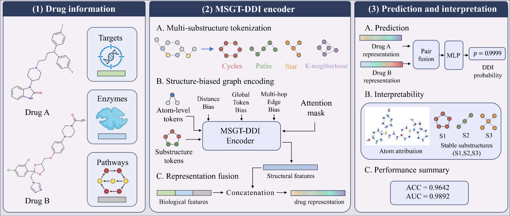

# MSGT-DDI

**MSGT-DDI: A Multi-Substructure Graph Transformer for Drug–Drug Interaction Prediction**

MSGT-DDI is a graph Transformer framework for binary drug–drug interaction (DDI) prediction. It represents four complementary molecular substructures—cycles, paths, star motifs, and k-neighborhoods—as explicit graph tokens, and integrates them with atom-level structural information and biological features.

<p align="center">
  
</p>

## Environment

The main experimental environment is:

- Python 3.8.20
- PyTorch 2.0.0 + CUDA 11.8
- PyTorch Geometric 2.6.1
- RDKit 2021.9.3
- NVIDIA GeForce RTX 4090 (24 GB)

A complete environment configuration is provided in `environment.yml`.

## Data

The experiments use a DrugBank-derived DDI benchmark. Dataset files should be placed under the `dataset/` directory before training.

## Training

Run the model with:

```bash
python train.py \
  --user-dir ./SGTDDI \
  --save-dir ckpts/ddi-1224-24 \
  --ddp-backend=legacy_ddp \
  --dataset-name mydata \
  --dataset-source pyg \
  --data-dir dataset \
  --task graph_prediction_ddi \
  --id-type cycle_graph+path_graph+star_graph+k_neighborhood \
  --ks [8,4,6,2] \
  --sampling-redundancy 6 \
  --criterion binary_logloss \
  --arch sgt_ddi \
  --deepnorm \
  --num-classes 1 \
  --num-workers 16 \
  --attention-dropout 0.1 \
  --act-dropout 0.1 \
  --dropout 0.0 \
  --optimizer adam \
  --adam-betas '(0.9,0.999)' \
  --adam-eps 1e-8 \
  --clip-norm 5.0 \
  --weight-decay 0.01 \
  --lr-scheduler polynomial_decay \
  --power 1 \
  --warmup-updates 640000 \
  --total-num-update 2560000 \
  --lr 2e-4 \
  --end-learning-rate 1e-6 \
  --batch-size 8 \
  --fp16 \
  --data-buffer-size 20 \
  --encoder-layers 24 \
  --encoder-embed-dim 80 \
  --encoder-ffn-embed-dim 80 \
  --encoder-attention-heads 8 \
  --max-epoch 1000 \
  --keep-best-checkpoints 2 \
  --keep-last-epochs 3 \
  --fuse-method concat \
  --do_project \
  --valid-subset valid,test \
  --output-folder ./result/
```

## Citation

If you use this code, please cite the corresponding MSGT-DDI paper after publication.

## Contact

For questions about the code, please contact the authors through the information provided in the manuscript.
